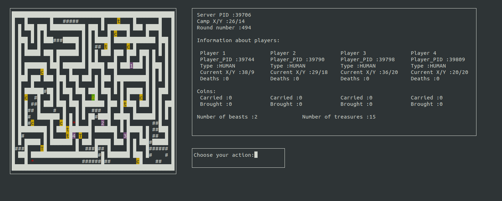
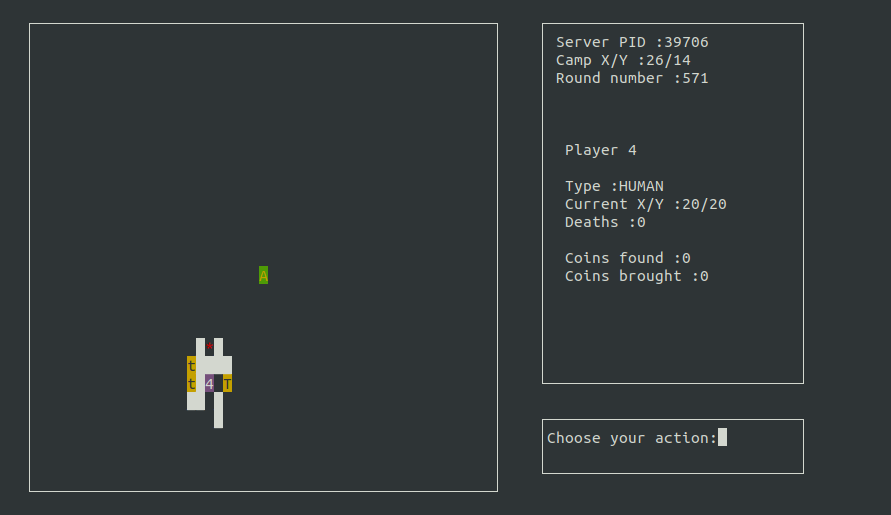

# Simple multi-threaded game
### Introduction:
This game based on Ncursed execution model.
### How it is working
The server send an information to each player and waiting for reply.
The main communication between the server and the player is done by using FIFO

### Picture below shows how does server look

### Picture below shows how does player(client) look

